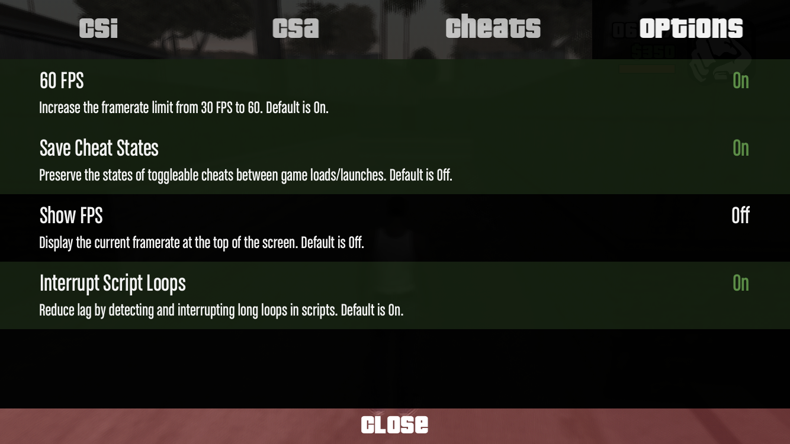
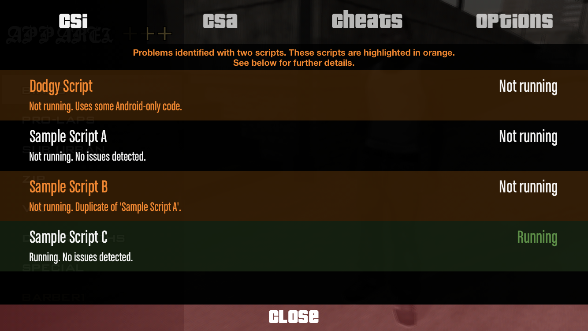
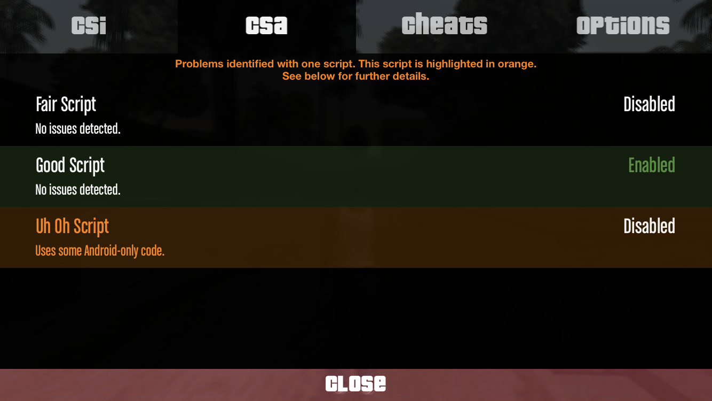
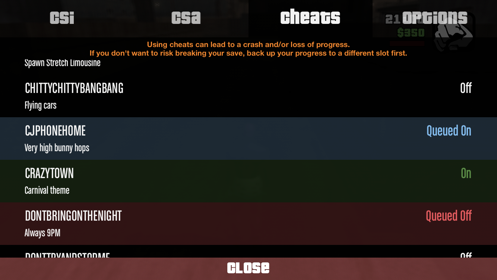

<h1 style="text-align: center">CLEO iOS</h1>

<!-- I love badges :D -->

<div style="text-align: center">
  <p>
    <a href="https://discord.gg/cXwkTUasJU">
    
    </a>
    
    
  </p>
  <p><a href="https://discord.gg/cXwkTUasJU"><strong>Join the Discord server for support, info and script suggestions</strong></a></p>
</div>

## Features

- File support
  - CSA scripts
  - CSI scripts
  - FXT language extensions
- Mod loading
  - Archive (`.img`) file modding
  - Automatic file replacement
- Cheat menu
- 60 FPS

## Languages

CLEO is available in several languages. All translations are written by a brilliant team of
volunteers. If you speak a language that isn't in this list, please ping me in the Discord server
or DM me on Discord and you can be come a translator!

* Arabic / العربيه (by RAiZOK)
* Czech / čeština (by tharryz)
* Dutch / Nederlands (by wewewer1)
* English
* Khmer / ខ្មែរ (by ODIN)
* Simplified Chinese / 中文（简体） (by tharryz)
* Slovak / slovenčina (by tharryz)
* Thai / ภาษาไทย (by Flylarb The BMO)
* Turkish / Türkçe (by AYZM)
* Vietnamese / Tiếng Việt (by tharryz)

## Installation

1. Download the .deb file from the [latest release](https://github.com/squ1dd13/CLEO-iOS/releases/latest).
2. Install the .deb using a tool like `dpkg` or through an app like Filza.

When the game is opened, if it has been at least five hours since the last check, CLEO will check to see if there is
a new release available. If there is one, a message will be displayed with the option to go to the [release](https://github.com/squ1dd13/CLEO-iOS/releases/latest).

To update CLEO, simply follow the above steps with the newer .deb. The package manager will handle the update,
and your mods will remain in place.

## Building

Developers: see the bottom of the README for instructions on how to build CLEO.

## Menu

The CLEO menu (or just "the menu") is used to control scripts, cheats and CLEO's own
options.

You can access it by swiping down on the screen. The menu is available
everywhere in the GTA app, but if you aren't in a game then you can only access the
CLEO options from it.

The Options tab contains a few settings. Some change how the game
behaves, while others change how CLEO behaves.

<p align="center">
  
</p>

Options that are enabled are green and show "On" on the right-hand
side of the screen. Options that are disabled have white text and display
the word "Off" instead.

Each option has a description which includes the default value of that setting.

If you have trouble using any part of the CLEO menu,
especially if due to something like
dyslexia or colourblindness, please mention it on Discord.

## Scripts

### Installation

1. Find a script that you want to use.
2. Navigate to the GTA app's data folder.
   This will be a folder in `/var/mobile/Containers/Data/Application`. If you are using Filza, you are looking for a folder displayed as `GTA: SA`. If not, the folder name will be the app's UUID. (Therefore it's easiest to use Filza for this.)
3. Open the `Documents` folder inside the app data folder.
4. Create a folder named `CLEO`. It may be a good idea to bookmark
   this folder so you can find it again later easily.
5. Put any `.csi`, `.csa` or `.fxt` files from the script into the
   `CLEO` folder. Any other files will be ignored, so you can add those
   if you don't want to lose them. If you want, you can create more
   folders inside the `CLEO` folder to organise your mods; CLEO will
   look inside these too.

### CSI Scripts

A "CSI" script (any script with the `.csi` file extension) is a script that will not run unless you tell it to.

<p align="center">
  
</p>

CLEO searches for these scripts and presents them in the CSI tab in the menu. Each script displays
its status – "Running" or "Not running" – on the right-hand side of the screen. Scripts that are
running will be shown in green, while scripts that aren't will be shown in white.

- To launch a CSI script, simply tap on it in the menu so that it turns green and says "Running".
- You cannot stop a script once it has started; it is up to the script to decide when
  it stops running.
- When a script stops, its status will change from "Running" to "Not running". You can then tap it to run it again.

There is a third colour: orange. An orange tint indicates that there is an issue with a script.
When CLEO detects that a script may cause issues such as a game crash, it warns you about the risk at the top of the menu, and highlights the potentially unstable script (or scripts) in orange.

There are several reasons why a script could be orange:

- It uses code that only works on Android (because the Android game is
  32-bit and the iOS game is 64-bit);
- It uses features which aren't yet implemented on iOS; or
- It is a duplicate of another script.

A single script may have multiple issues, but only one will ever be
shown.

This system is not 100% perfect. You should still exercise caution when using scripts, even
if they aren't orange.

When you see a script highlighted in orange, it doesn't mean that it won't run, but it does mean
that there is something about the script that could cause problems. There are some scripts which
will show in orange but which will run perfectly fine on iOS – you can try an orange script, but you
should be ready for the game to crash if you do.

Most non-orange scripts should work fine. If you find a script that doesn't work and that is not
highlighted in orange, please report it via Discord.

### CSA Scripts

CLEO also supports "CSA" scripts (scripts with the `.csa` file extension).
CSA scripts start when the game starts unless you turn them off in the menu.

Before CLEO 2.1.0, CSI and CSA scripts were together in one "Scripts" tab. Since 2.1.0, there has been
a separate tab for CSA scripts. This tab allows you to turn certain scripts off if you do not want to
use them.

<p align="center">
  
</p>

The CSA script shares many features with the CSI menu: scripts that are enabled are green, scripts which are disabled are white, and those with errors are orange.

Orange CSA scripts are disabled by default to prevent them crashing your game as soon as they start running. If you tap an orange script in the CSA menu, it will
not change from "Disabled" to "Enabled", but from "Disabled" to "Forced", which
functions the same as "Enabled". Other CSA scripts are enabled by default.

If you experience crashing and you can't get to the menu to turn off a script,
simply remove the script you think is responsible from your CLEO folder.

As with CSI scripts, if you find a CSA script which is not highlighted in orange that doesn't work, please report it via the Discord server.

## Archives

An archive is any file with the `.img` extension. Archives are like folders:
they contain many smaller files.

Many important aspects of the game rely on archives. For example, car models are stored
in the `gta3.img` archive. To change a car model, you'll need to change the files that
live _inside_ the archive.

To do this, you need to have a folder inside the CLEO directory with the same name as
the archive. So, for car models, you would need a folder named `gta3.img`. If you've
already run the game with CLEO installed, all the `.img` folders will have been created for
you. If you haven't, just create the folder manually (and make sure you get the name
correct – capitalisation matters here).

(Some mods might need you to modify a different archive such as `player.img`.
The process is the same for those too; we're just using `gta3.img` as an example.
Just make sure you are following the instructions for the mod you're trying to use.)

Your CLEO folder should now look like this:

```
CLEO
│    ...
└─── gta3.img (empty folder)
```

How do we actually change the car models though? It's simple: just add files to the `gta3.img` folder, and if the game tries to load that file from the archive, CLEO will
make it use the version inside your folder instead. Let's try it.

If we add a file named `clover.dff` to the `gta3.img` folder, instead of loading that file
from the archive, the game will use the one inside the folder.

Now the CLEO folder looks like this:

```
CLEO
│    ...
└─── gta3.img
     └── clover.dff
```

If we go into the game now, the "Clover" car will be using our custom model instead of the
default one.

Remember that this will work for any mod or archive. To do this for another
archive, just use the name of that archive instead of `gta3.img`.

## Swapping Game Files

Some mods require you to change game files. While it is completely possible to just go into
`gta3sa.app` and change files there, there's a better way: using CLEO's file swapping
functionality.

If you modify your game files, you can risk breaking the game completely (especially if
you don't back up the original files). To avoid this risk, CLEO provides a
folder where you can put files that you'd like to replace game files with.

This folder is called `Replace`, and it lives inside the `CLEO` directory. If you've run the game with CLEO installed, then you'll already have this folder. If you don't have it,
you'll need to make it yourself.

You can think of `Replace` as being like a mini version of the game directory. Whenever
the game looks for a file, it will look inside the `Replace` folder first. If it finds
the file there, it will load it from there. Otherwise, it will just load the file from
`gta3sa.app`.

Let's try an example with `timecyc.dat`, which controls how the game's environment changes
based on the in-game time.

Normally, the game will just load `gta3sa.app/timecyc.dat` when it needs the file.
However, if we add a file named `timecyc.dat` to the `Replace` folder, it'll load from
there instead.

The CLEO folder will look like this:

```
CLEO
│    ...
└─── Replace
     └── timecyc.dat
```

It's that simple! If we later decide we want to go back to the original version of the file,
we can just delete `timecyc.dat` from the `Replace` folder, and the game will go back to
using its own version of the file. You don't need to back up files if you are replacing
them with `Replace`.

## Cheats

The menu has a Cheats tab which contains a list of cheats, each displaying its code and a
description.

<p align="center">
  
</p>

If you look at the above image, you'll notice that there are four different colours of
cheat displayed. These represent the cheat status:

- **White** – This means a cheat is **Off**. A cheat that looks like this is not affecting the game.
- **Blue** – The cheat is **Queued On**. This means that it will be activated when you leave the
  menu.
- **Green** – The cheat is **On**, and is affecting the game.
- **Red** – The cheat is **Queued Off**, meaning that it will be disabled when you leave the
  menu.

Some cheats will never display the "On" status, because they are "one-shot". This means
that they do not have an ongoing effect on the game, and instead do something once (giving
the player money, for example). Other cheats _will_ turn on, and these cheats are
"persistent" cheats, meaning that they will affect the game while they are turned on
(by modifying cars' handling, for example). The effect will stop when you turn the cheat
off.

You can change a cheat's status by tapping on it in the menu. The reason you cannot turn
a cheat "On" or "Off" immediately (without going through a "Queued" stage) is because
cheats cannot run while the CLEO menu is open, as the game is paused. "Queued" just means
that the cheat is waiting for the game to resume in order to change its status.

The cheats are arranged in alphabetical order, so if you know a cheat code, just scroll down
to where it would be alphabetically to find it.

Cheats can break save files and/or crash the game, so you should be careful when using
them. Some cheat descriptions will say that the cheat crashes the game, so make sure you
read the description before using the cheat.

## What do I do if I need help/found a bug/have a suggestion?

Please don't keep quiet about it!

If you have a suggestion or you think you've found a bug, either
create an issue on GitHub or join the [Discord server](https://discord.gg/cXwkTUasJU) to
discuss it there. The more bugs that get fixed, the better CLEO will
become for you and everybody else!

If you need help with something, please join the Discord server so
we can assist you there. Also, don't forget that you can read
through the step-by-step instructions on this page if you can't
remember how to do something.

## Building

**Ignore this section if you are not a developer.**

### Rust setup
You will need to install Rust on your system before compiling CLEO (since it's written in Rust).
If you don't have it installed already, go to https://www.rust-lang.org/learn/get-started and
follow the instructions there. If you do have it installed, it might be worth running `rustup
update` to ensure you're on the latest version.

CLEO needs features that are only available in the `nightly` toolchain. If you get start a shell in
the CLEO folder, you can use `rustup override set nightly` to set the toolchain to nightly for that
directory.

You'll need to have the `aarch64-apple-ios` target too, so run `rustup target add
aarch64-apple-ios` to set that up.

### `build.py`

CLEO is typically built using the `build.py` script in the main directory. This script compiles
the Rust code and produces a dynamic library (`.dylib`), but it can also do a couple of other
things.
* `--release` will build a release version of the tweak. If you don't specify this, the tweak
  will be built in debug mode. The output of a release build is
  `target/aarch64-apple-ios/release/cleo.dylib`. Debug builds go in
  `target/aarch64-apple-ios/debug`.
* `--package` will create `cleo.deb` in the same folder as `cleo.dylib`. This can be used to
  install the tweak.
* `--install` will install the tweak to a device. If you use `--package`, this will copy `cleo.deb`
  to the device and install it. Otherwise, it will just copy `cleo.dylib` and `cleo.plist` onto the
  device, overwriting the previous versions of those files. **If the device doesn't have CLEO
  installed yet, use `--package` on the first install.**

`build.py` relies on a few environment variables to work. In order to use `--install`, you must
first set `CLEO_INSTALL_HOST` to either the hostname or IP address of the device the tweak should
be installed to. There are other variables too, but the values for these depend on your platform.

See below for platform-specific instructions.

### Linux
On my Manjaro machine there was not a lot of setup required to build CLEO. The main thing you need
is an iOS toolchain, because we need `clang` and `ldid` in order to create a .dylib from the .ar
file that `rustc` gives us.

I use [Sam Bingner's Linux iOS toolchain](https://github.com/sbingner/llvm-project), which has
worked for me on both Ubuntu and Manjaro, and I've been using it since the original C++ CLEO. You
can install it by downloading the `.tar.lzma` file from the latest release and extracting it into a
folder somewhere on your system.

This toolchain contains both `ldid` and Apple's build of `clang`. Once you've extracted it, just
set `CLEO_CLANG` and `CLEO_LDID` to the paths to those tools in the toolchain. They can be found
inside the `bin` folder.

For example, I use the following:
* `CLEO_CLANG="/home/squ1dd13/projects/ios/toolchain/bin/clang"`
* `CLEO_LDID="/home/squ1dd13/projects/ios/toolchain/bin/ldid"`

You'll also need an iOS SDK. I currently build against an iOS 13.2 SDK. I can't remember where I
got it from, but there are loads of places you can get iOS SDKs. You should end up with a folder
called `iPhoneOSxx.x.sdk` (or just `iPhoneOS.sdk`). The path to this folder is what you should set
`CLEO_IOS_SDK` to. Mine is `/home/squ1dd13/projects/ios/iPhoneOS.sdk`.

I had to manually get `dpkg-deb` on my Manjaro system, but that was as simple as `yay -S dpkg`. If
you don't have this already, you'll need to find out how to get it for your specific distro.

Installation to a device requires `scp`, so make sure you have that too.

### macOS

`rustc` can produce `.dylib` files on macOS. `build.py` tells it to do that when it detects a macOS
system, but for whatever reason, this override doesn't work and the build process goes the same as
on Linux, producing an AR archive. You can change `crate-type = ["staticlib"]` to `crate-type =
["cdylib"]` in `Cargo.toml`, and you will get a .dylib from `rustc`.

If you don't already have it, you can get `dpkg` from Homebrew with `brew install dpkg`. This
installs the `dpkg-deb` command. You don't need `clang` for building on macOS, but you will need
`ldid`. This can be installed with `brew install ldid`. Once you have it, just set `CLEO_LDID` to
the path to the installed executable.

For some reason, versions of the tweak built with macOS crash on startup. It appears to be
something to do with the panic hook that CLEO installs, but it's unclear as to what differs between
Linux and macOS builds that would cause that.

### Windows

I'd recommend using WSL and following the Linux guide. If anyone gets CLEO built on Windows without
using WSL, please feel free to add an explanation here.

## Thanks to...

- The translator team for their hard work helping people from all around the world use CLEO:
  - AYZM
  - Flylarb The BMO
  - ODIN
  - RAiZOK
  - tharryz
  - wewewer1
- [Seemann](https://github.com/x87) for offering support and info, and for letting this project
  officially be a part of [CLEO](http://cleo.li/).
- [Alexander Blade](http://www.dev-c.com/) for creating CLEO Android, and for publishing
  information on his Android-specific opcodes
  [here](https://gtaforums.com/topic/663125-android-cleo-android/).
- [DK22Pac](https://github.com/DK22Pac) and all the others who have contributed to
  [plugin-sdk](https://github.com/DK22Pac/plugin-sdk), which has been very helpful for creating
  game structures.
- All those who have contributed to the [gta-reversed](https://github.com/codenulls/gta-reversed)
  project, which has been a valuable resource for building my understanding of some of the more
  complex systems that are in both the PC and iOS versions.
- oliver#1219 for gifting me the other GTA games to help with getting CLEO working on those too.
- Members of the CLEO iOS [Discord server](https://discord.gg/cXwkTUasJU) for reporting bugs,
  helping investigate them and testing fixes.
- The GTA modding community in general for doing so much of the research which made CLEO iOS
  possible!
